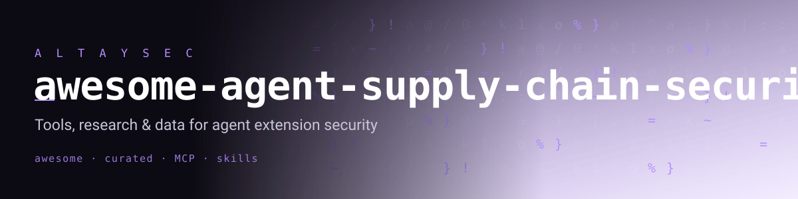

# Awesome Agent Supply-Chain Security 

> A curated list of tools, research, standards, datasets and reading on the
> **security of AI agent extensions** — the skills, MCP servers, plugins and
> rules files that agents now install like software packages.

AI agents increasingly install third-party **extensions**: Agent/Claude
**Skills**, **MCP** (Model Context Protocol) servers, IDE **rules files**
(`.cursorrules`, `CLAUDE.md`, `AGENTS.md`) and plugins. These behave like a new
software supply chain — but the review model hasn't caught up, and the core
problem is structural: **an LLM agent cannot reliably separate instructions from
data**, so any text an extension carries (even text you cannot see) can become a
command.

**Why this list exists.** Snyk's *ToxicSkills* study scanned 3,984 marketplace
skills and found ~36% carried security flaws, 13.4% critical, with 76 confirmed
malicious payloads; Koi Security flagged 341 malicious skills in a single
marketplace audit, 335 from one coordinated campaign. The threat is real, moving
fast, and scattered across vendor blogs. This list gathers it in one place.

## Contents

- [Standards & Frameworks](#standards--frameworks)
- [Scanners & Tools](#scanners--tools)
- [Adjacent: LLM Red-Teaming & Guardrails](#adjacent-llm-red-teaming--guardrails)
- [Vulnerable Labs & Training](#vulnerable-labs--training)
- [Attack Research & Papers](#attack-research--papers)
- [Empirical Studies & Reports](#empirical-studies--reports)
- [Datasets](#datasets)
- [Defense Guidance](#defense-guidance)
- [Related Awesome Lists](#related-awesome-lists)
- [Contributing](#contributing)

## Standards & Frameworks

- [OWASP Agentic Skills Top 10](https://owasp.org/www-project-agentic-skills-top-10/) - Emerging OWASP project cataloguing the top risks of agent skills (AST01 *Malicious Skills*, …).
- [OWASP Top 10 for LLM Applications (2025)](https://genai.owasp.org/llm-top-10/) - The reference risk taxonomy for LLM apps; LLM01 Prompt Injection and LLM06 Sensitive Information Disclosure underpin most extension attacks.
- [MITRE ATLAS](https://atlas.mitre.org/) - Adversarial threat landscape for AI systems; includes LLM prompt-injection and MCP-compromise techniques.
- [NIST AI 600-1 — Generative AI Profile](https://www.nist.gov/itl/ai-risk-management-framework) - Risk-management guidance for generative AI, useful for mapping controls.
- [Model Context Protocol](https://modelcontextprotocol.io/) - The MCP spec itself; understanding the tool/description model is prerequisite to securing it.

## Scanners & Tools

- [NVIDIA/SkillSpector](https://github.com/NVIDIA/SkillSpector) - Security scanner for AI agent skills; covers homoglyph/RTL/zero-width and more.
- [snyk/agent-scan](https://github.com/snyk/agent-scan) - Security scanner for AI agents, MCP servers and agent skills (successor to invariantlabs-ai/mcp-scan).
- [cisco-ai-defense/skill-scanner](https://github.com/cisco-ai-defense/skill-scanner) - Scanner for agent skills; added invisible-Unicode (Tags-block) detection in 2026.
- [Tencent/AI-Infra-Guard](https://github.com/Tencent/AI-Infra-Guard) - Full-stack AI red-teaming platform covering MCP and agent components.
- [riseandignite/mcp-shield](https://github.com/riseandignite/mcp-shield) - Security scanner for MCP servers (tool-poisoning, etc.).
- [trailofbits/mcp-context-protector](https://github.com/trailofbits/mcp-context-protector) - Runtime security wrapper for MCP that mediates tool calls.
- [hashgraph-online/hol-guard](https://github.com/hashgraph-online/hol-guard) - Guard for agent skills / prompt-injection and exfiltration patterns.
- [getagentseal/agentseal](https://github.com/getagentseal/agentseal) - Agent-extension vetting/sealing tool.
- [uncloak](https://github.com/fevziegeyurtsevenler/uncloak) - Zero-dependency, **multilingual** scanner for hidden prompt injection & supply-chain risks in Skills, MCP configs and rules files; decodes invisible Unicode, maps findings to OWASP/ATLAS, emits SARIF.
- [llm-security-skills](https://github.com/fevziegeyurtsevenler/llm-security-skills) - Agent Skills that turn a coding agent into an LLM security reviewer (prompt-injection testing, OWASP LLM Top 10 audit, MCP/RAG review, KVKK/PII), EN + TR.

## Adjacent: LLM Red-Teaming & Guardrails

Not extension-specific, but foundational for testing and defending the agents that load extensions.

- [NVIDIA/garak](https://github.com/NVIDIA/garak) - The LLM vulnerability scanner; large probe library.
- [promptfoo/promptfoo](https://github.com/promptfoo/promptfoo) - Test/red-team prompts, agents and RAG pipelines.
- [microsoft/PyRIT](https://github.com/microsoft/PyRIT) - Python Risk Identification Tool for generative AI.
- [protectai/llm-guard](https://github.com/protectai/llm-guard) - Security toolkit for LLM interactions (input/output scanners).
- [guardrails-ai/guardrails](https://github.com/guardrails-ai/guardrails) - Add programmable guardrails to LLM output.
- [NVIDIA-NeMo/Guardrails](https://github.com/NVIDIA-NeMo/Guardrails) - Toolkit for adding programmable rails to conversational agents.
- [protectai/rebuff](https://github.com/protectai/rebuff) - Prompt-injection detector (archived, still a useful reference).
- [Trusted-AI/adversarial-robustness-toolbox](https://github.com/Trusted-AI/adversarial-robustness-toolbox) - Broad adversarial ML library.

## Vulnerable Labs & Training

- [harishsg993010/damn-vulnerable-MCP-server](https://github.com/harishsg993010/damn-vulnerable-MCP-server) - Intentionally vulnerable MCP server for hands-on practice.
- [ReversecLabs/damn-vulnerable-llm-agent](https://github.com/ReversecLabs/damn-vulnerable-llm-agent) - Deliberately vulnerable LLM agent (tool abuse, injection).
- [CyberSunil/LLMVault](https://github.com/CyberSunil/LLMVault) - Training platform for the OWASP LLM Top 10.
- [snyk-labs/toxicskills-goof](https://github.com/snyk-labs/toxicskills-goof) - Deliberately malicious agent skills for learning to detect them.

## Attack Research & Papers

- [llm-attacks/llm-attacks](https://github.com/llm-attacks/llm-attacks) - Universal and transferable adversarial attacks on aligned LLMs (GCG).
- [verazuo/jailbreak_llms](https://github.com/verazuo/jailbreak_llms) - [CCS'24] dataset of in-the-wild jailbreak prompts.
- [greshake/llm-security](https://github.com/greshake/llm-security) - Foundational work on indirect prompt injection in app-integrated LLMs.
- [tldrsec/prompt-injection-defenses](https://github.com/tldrsec/prompt-injection-defenses) - Practical and proposed defenses against prompt injection.
- [SkillSieve (arXiv:2604.06550)](https://arxiv.org/abs/2604.06550) - A hierarchical triage framework for detecting malicious AI agent skills.

## Empirical Studies & Reports

- [Snyk — ToxicSkills study](https://snyk.io/blog/toxicskills-malicious-ai-agent-skills-clawhub/) - 3,984 skills scanned; ~36% with flaws, 1,467 vulnerable, 76 malicious payloads.
- [Snyk — clawdhub malicious campaign](https://snyk.io/articles/clawdhub-malicious-campaign-ai-agent-skills/) - Reverse-shell-dropping skills on a marketplace.
- [Snyk — malicious "Google" skill on ClawHub](https://snyk.io/blog/clawhub-malicious-google-skill-openclaw-malware/) - Case study of a single malicious skill.
- [obot.ai — securing MCP & agent skills](https://obot.ai/blog/mcp-security-agent-skills-supply-chain/) - Overview of the new supply-chain frontier.
- [skills-in-the-wild](https://github.com/fevziegeyurtsevenler/skills-in-the-wild) - Open, reproducible audit of public agent-extension files on GitHub (dataset + findings + method) — complements the closed-data vendor studies above.

## Datasets

- [verazuo/jailbreak_llms](https://github.com/verazuo/jailbreak_llms) - 15k+ in-the-wild jailbreak prompts.
- [AltaySec/turkish-llm-injection](https://huggingface.co/datasets/AltaySec/turkish-llm-injection) - Turkish-language prompt-injection dataset (non-English coverage is a common blind spot).
- [prompt-injection-corpus](https://github.com/fevziegeyurtsevenler/prompt-injection-corpus) - Multilingual (EN+TR) prompt-injection & jailbreak technique corpus, each entry paired with its defense.
- [skills-in-the-wild dataset](https://github.com/fevziegeyurtsevenler/skills-in-the-wild) - Labeled findings over real public agent extensions.

## Defense Guidance

- [The lethal trifecta](https://simonwillison.net/tags/lethal-trifecta/) - Simon Willison's framing: private data + untrusted content + outbound channel = data theft. Break one leg.
- [Prompt injection resources](https://simonwillison.net/tags/prompt-injection/) - Ongoing catalogue of prompt-injection attacks and defenses.
- **Sandbox & least privilege** - Isolate agents; allowlist egress and file access.
- **Provenance & signing** - Signatures prove code *didn't change*, not that it's *safe* — necessary but not sufficient.
- **Render the invisible** - Enable "render control characters" in your editor; scan before install.

## Related Awesome Lists

- [corca-ai/awesome-llm-security](https://github.com/corca-ai/awesome-llm-security)
- [Puliczek/awesome-mcp-security](https://github.com/Puliczek/awesome-mcp-security)
- [ottosulin/awesome-ai-security](https://github.com/ottosulin/awesome-ai-security)
- [TalEliyahu/Awesome-AI-Security](https://github.com/TalEliyahu/Awesome-AI-Security)
- [yueliu1999/Awesome-Jailbreak-on-LLMs](https://github.com/yueliu1999/Awesome-Jailbreak-on-LLMs)
- [Darkmoon](https://github.com/ASCIT31/Dark-Moon) - an open source (GPL-3.0) autonomous AI penetration testing platform for web, API, Active Directory and Kubernetes.
- [wearetyomsmnv/Awesome-LLMSecOps](https://github.com/wearetyomsmnv/Awesome-LLMSecOps)

## Contributing

Contributions welcome! Please read [CONTRIBUTING.md](CONTRIBUTING.md). Add entries
in the form `- [name](link) - description.`, keep them alphabetical within a
section where practical, and only submit resources that are genuinely useful and
maintained. New attack techniques, empirical studies and defenses are especially
valued.

## License

To the extent possible under law, the maintainers have waived all copyright and
related or neighboring rights to this work.
